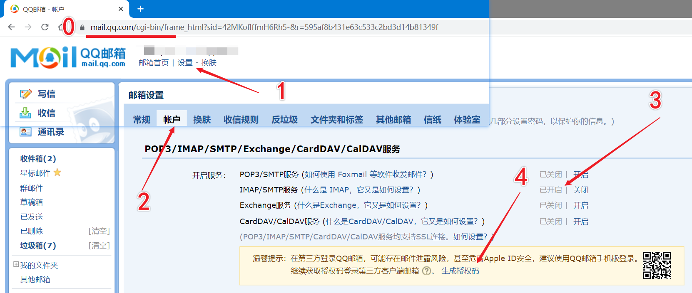

# started-notify
github repository started notify 💕

当有人标星（Star）时，发送邮件提醒。

## 使用方法

1. 将 [.github/workflows/star_notify.yml](https://github.com/foyoux/started-notify/blob/main/.github/workflows/star_notify.yml) 文件复制到需要提醒标星的项目 `.github/workflows/` 目录（没有就创建）下
2. 添加 [Actions secrets](https://docs.github.com/en/actions/security-guides/encrypted-secrets)
   1. `POST_EMAIL`: 发送邮件的邮箱（暂时只支持QQ邮箱）
   2. `POST_EAMIL_TOKEN`: 发邮件的邮箱授权码
   3. `NOTIFY_EMAIL`: 接收邮件的邮箱（可以和发送邮箱相同，因为自己可以和自己发邮箱）

## 获取邮箱授权码

